# スプライト素材作成フロー

本書は、任意のスプライト企画を共通工程へ流す手順である。
各ツールの引数と責務は[ツール一覧](ツール一覧.md)を正とする。

```mermaid
flowchart LR
    subgraph planning[企画書作成フェーズ]
        idea[制作意図の整理] --> brief[企画書作成]
        brief --> rv0[RV-0: 企画書レビュー]
    end
    subgraph specification[仕様策定フェーズ]
        specs[asset spec / animation spec / Pose Guide] --> rv1[RV-1: 仕様レビュー]
    end
    rv0 --> specs
    rv1 --> keyframe[基準キーフレームを1枚生成]
    keyframe --> rv2[RV-2: 基準キーフレームレビュー]
    rv2 --> representative[代表パターンの一連動作を生成]
    representative --> preview[代表パターンをプレビュー]
    preview --> rv3[RV-3: 代表動作レビュー]
    rv3 --> all_frames[残りを含む全フレームを生成]
    all_frames --> build[組版]
    build --> validate[自動検査]
    validate --> final_preview[全clipプレビュー]
    final_preview --> rv4[RV-4: 最終レビュー]
    rv4 --> manifest[manifest記録]
    manifest --> promote[採用]
```



## 0. 企画書作成フェーズ

企画書は最初に作成し、人間が承認する。AIは聞き取り、たたき台、懸念点の洗い出しを支援するが、制作意図と採用判断は人間が決める。

1. [企画書テンプレート](企画書テンプレート.md)を使い、目的、ゲーム上の役割、演出の流れ、見た目、必要なclip / variant / フレーム数の目安、完成条件を記す。
2. 表示開始・終了、hit・発射・効果音など、ゲームと同期すべき瞬間を明記する。
3. キャラクターでは固定要素と禁止事項、エフェクトでは色・形・粒子・余韻の許容範囲を明記する。

### RV-0: 企画書レビュー

- 何をプレイヤーに伝える素材かが明確である。
- 必要なclip、variant、フレーム数の目安がゲーム上の役割に合う。
- 演出意図、禁止事項、参照の出所、完成条件に未決事項がない。
- 承認者が、仕様策定と制作へ進めてよいと判断している。

## 1. 仕様策定フェーズ

RV-0承認後、企画書の内容を実制作用の仕様一式へ具体化する。

1. asset specにprofile、canvas、gridまたはatlas、anchor、パレット、profile固有の正規化条件を定義する。
2. animation specにclip、variant、全frame ID、frame順、placement、duration、eventsを定義する。企画書のフレーム数の目安を、漏れのないframe一覧へ確定する。
3. 各frameのPose Guideに、視点・向き・ポーズ・root・接地点・武器／粒子位置・維持要素を定義する。
4. キャラクターはCharacter Master、Direction Reference、Style Referenceを用意する。エフェクトは色・形・広がり方・残像の参照と、中心または発生点の基準を用意する。

### RV-1: 仕様レビュー

- frame IDとplacementに重複・欠落がない。
- clipのループ、fps、duration、eventがゲーム上の意図と一致する。
- profileが素材の性質に合い、character専用cleanupを粒子素材へ誤適用しない。
- anchorとcanvasに、攻撃範囲・発射点・着弾点・足元が収まる。

## A. 基準キーフレームを1枚生成する

1. asset全体の見た目を代表できる**基準キーフレームを1枚だけ**AIで生成する。完成sheetを生成器へ依頼しない。
2. characterでは、顔・衣装・武器・ゲーム内の頭身が最も読み取りやすいポーズを選ぶ。effectでは、色・形・粒子密度を代表する最大強度付近のフレームを選ぶ。
3. `raw/`へ候補と生成条件を残し、`extract_alpha.py`、`pixelize_frame.py`、必要なcleanupを通して、ゲーム内サイズで確認できる状態にする。
4. 人が色、向き、ポーズ、固定要素、粒子の密度、フレーム外へのはみ出しを確認する。不合格なら、この1枚だけを作り直す。

### RV-2: 基準キーフレームレビュー

基準キーフレームが、以降のAI生成で使う固定の見た目参照として十分かを確認する。人物では外見・武器・頭身・足元、effectでは色・形・粒子の密度・透明背景を重点的に見る。承認済みの画像はCharacter MasterまたはEffect Masterとして固定し、後続フレームの生成入力に使う。

## B. 代表パターンの一連動作を生成・確認する

RV-2承認後、全パターンへ展開する前に、もっとも代表的なclip / variantを一つ選び、その一連の全frameを生成する。8方向移動なら標準方向の停止＋歩行、8方向攻撃なら標準方向の予備動作→攻撃→戻り、無方向effectなら開始→最大強度→消滅の全frameを対象にする。

この段階では、基準キーフレームを固定の主参照にし、Pose GuideとDirection / Style Referenceを併用する。直前frameだけを次frameの主参照として連鎖させない。これにより、生成を重ねたことによる別人化・配色崩れを防ぐ。

```text
python tools/preview_sprite_animation.py --spec <asset-spec.json> --animation <animation-spec.json> --frames-dir work/<asset-id>/frames --output work/<asset-id>/reports/reviews/clip-review.html
```

### RV-3: 代表動作レビュー

- loop端、フレーム時間、攻撃の溜めと抜け、エフェクトの余韻を確認する。
- `events`が意図したframeにあることを確認する。
- 動作の連続性を壊さず、基準キーフレームと同じ外見・配色・輪郭を保てていることを確認する。

## C. 残りを含む全フレームを生成する

RV-3承認後、残るclip・variant・frameを生成する。すべてのframeで、承認済みの基準キーフレーム、代表動作、Pose Guide、Direction / Style Referenceを共通の入力として使う。frameの生成・正規化・cleanup・個別確認は1枚ずつ行い、不合格なら該当frameだけを作り直す。

## D. 組版・検査・採用

```text
# 個別frameからgridまたはatlasを組版する
python tools/build_sprite.py --spec <asset-spec.json> --animation <animation-spec.json> --frames-dir work/<asset-id>/frames --output work/<asset-id>/<asset-id>_candidate.png --report work/<asset-id>/reports/build.json

# 共通検査とprofile固有検査を実行する
python tools/validate_sprite.py --spec <asset-spec.json> --animation <animation-spec.json> --build-report work/<asset-id>/reports/build.json --input work/<asset-id>/<asset-id>_candidate.png --report work/<asset-id>/reports/validation.json

# 完成sheetで全clipをレビューする
python tools/preview_sprite_animation.py --spec <asset-spec.json> --animation <animation-spec.json> --input work/<asset-id>/<asset-id>_candidate.png --output work/<asset-id>/reports/reviews/final-review.html

# 検査とRV-1〜RV-4を記録してから昇格する
python tools/promote_sprite.py --spec <asset-spec.json> --animation <animation-spec.json> --build-report work/<asset-id>/reports/build.json --input work/<asset-id>/<asset-id>_candidate.png --target <Godotが読むPNG>
```

### RV-4: 最終レビュー

全clip・variantを再生し、透明背景、セル越境、人物の足元、攻撃の判定同期、エフェクトの分離粒子と消滅、ゲーム中の読みやすさを確認する。validator合格だけでは採用しない。
