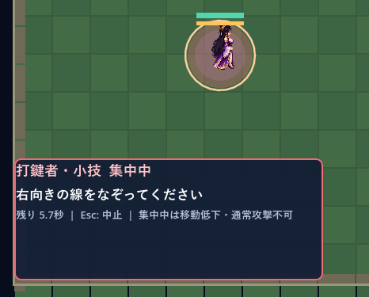
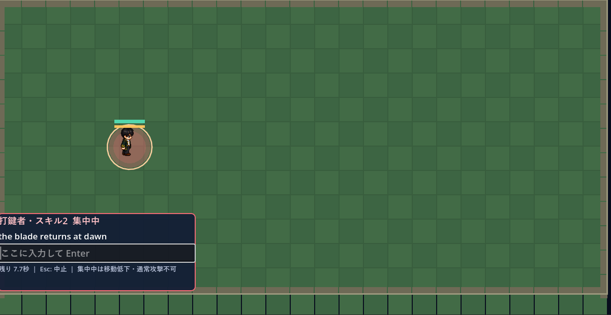

# 詠唱者の機能改善

## 何をなぞるのかわからない。
画像のように、どこに「右向きの線」があるのかがわからない
なぞるべき線を表示するようにしたい。

## 実現方法の方針

- 正解の線は画像ではなく、開始点・中間点・終了点からなる点列（`Vector2`配列）として定義する。
- 課題ウィンドウを拡大し、その中の専用描画領域に正解の点列を半透明の太線で表示する。始点は丸、終点は矢印にしてなぞる向きも示す。
- プレイヤーのマウス軌跡も点列として記録し、正解の線と重ねて描画する。
- 採点は次を組み合わせる。
  - 入力の開始点・終了点が正解の開始点・終了点に近いか
  - 入力軌跡の各点が、正解の線分からどれだけ離れているか
  - 正解の線を細かく分割した各地点の近くを入力軌跡が通った割合（なぞり残しの判定）
- 小スキルは直線、大スキルは星形など、同じ点列の仕組みでお題を増やせるようにする。

## スキルウィンドウの拡大
そもそも全キャラスキルウィンドウが小さい
画面左下1/4程度を占めるくらいでよい
