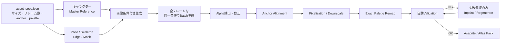
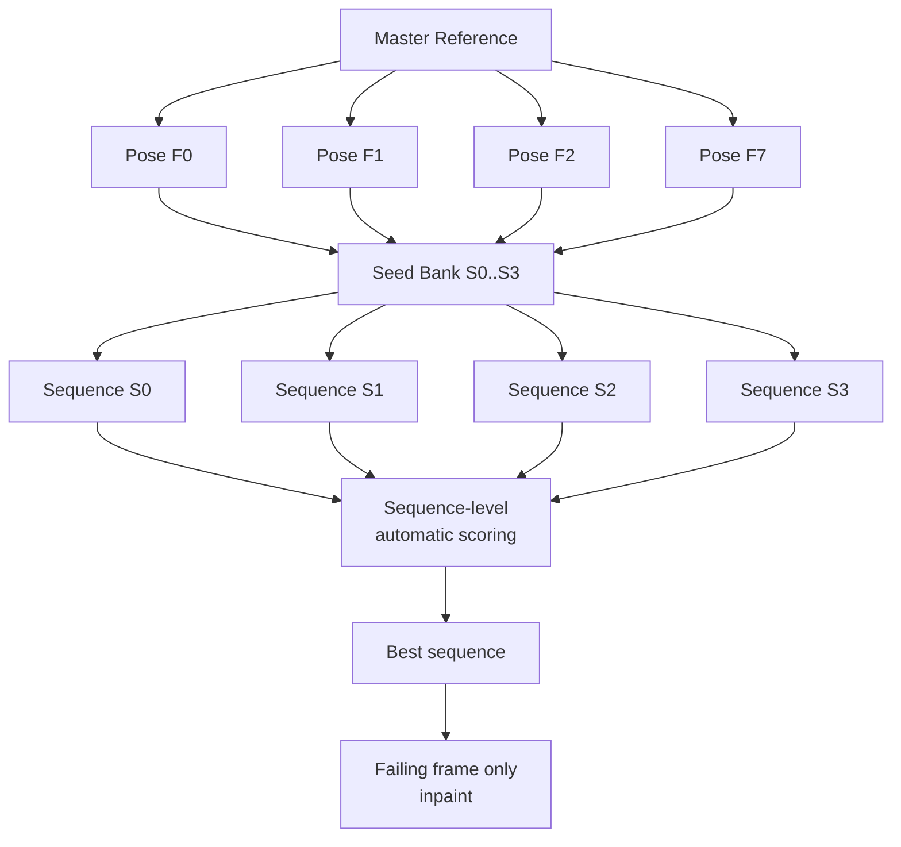
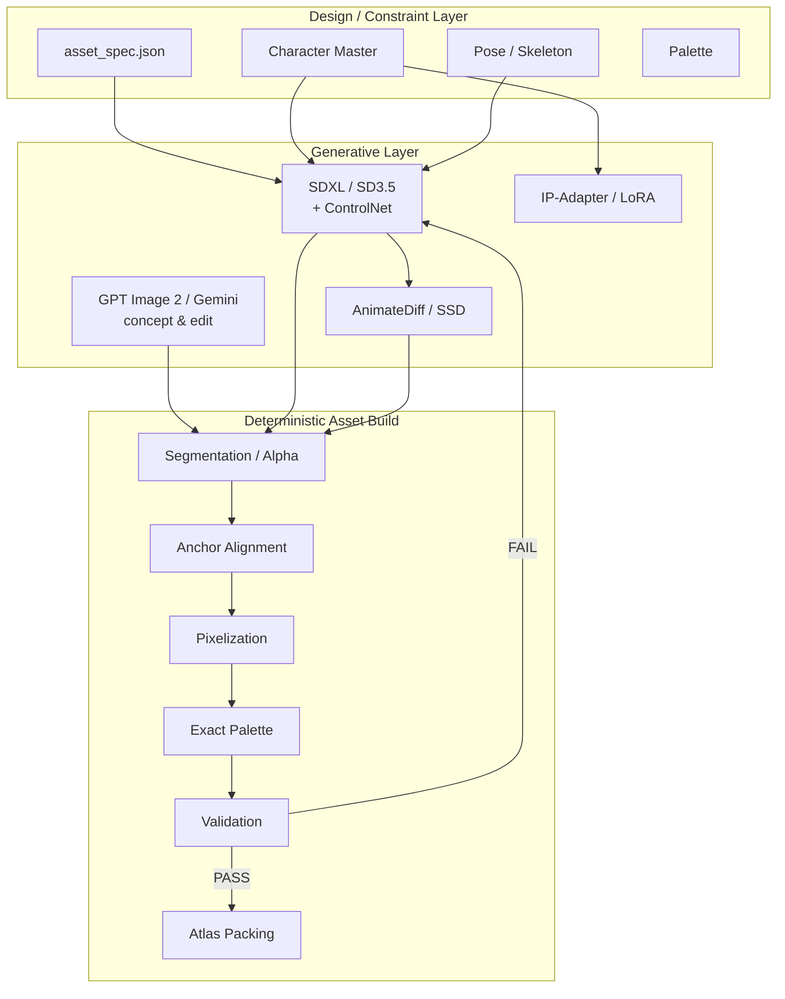

# AIでゲーム用2Dスプライト素材を生成する実装ノウハウ調査

## エグゼクティブサマリと対象範囲

**調査時点：2026年8月30日。**

結論から言うと、ゲーム用スプライトをAIで安定して量産するには、**「プロンプトを工夫して一発生成する」方式ではなく、生成AIを“非決定的なレンダラ”として扱い、その前後を決定論的な工程で挟む**のが最も実用的です。特に歩行・攻撃アニメーションでは、キャラクターの見た目、足元座標、ポーズ、キャンバス、パレット、透過をすべて自然言語だけに任せると破綻しやすくなります。ControlNetはまさにこの問題に対してエッジ、深度、人間姿勢などの空間条件を画像生成へ追加する手法であり、画像参照用のIP-AdapterやLoRA、時系列用AnimateDiffと組み合わせられます。 citeturn18search1turn18search20turn18search0

OpenAIの現行Codexにも画像生成機能があり、公式ドキュメントは用途として明示的に「sprite sheets」を挙げています。さらに公式ショーケースには、Codex＋ImageGenでモンスターのアニメーション・スプライトシートやダンジョンタイルを生成する例があります。したがってCodexでスプライトを作ること自体は公式想定用途です。ただしGPT Imageの公式APIドキュメント自身が、**繰り返し登場するキャラクターの一貫性**と**厳密な構図配置**には依然として限界があると説明しています。したがって「Codexが悪い」というより、Codexが呼び出す画像生成モデルを、規格管理・ポーズ管理なしで使った場合に問題が表面化すると理解するのが正確です。 citeturn16search2turn16search0turn17search0

本調査での**第一推奨パイプライン**は次です。



**ローカルGPUで品質と制御を優先する場合**は、SDXLまたはStable Diffusion 3.5を基盤として、ControlNet＋画像参照＋必要ならLoRAを組み、アニメーションにはAnimateDiffまたは研究用途のSprite Sheet Diffusionを検討するのが合理的です。SDXLは高解像度生成用に拡張されたlatent diffusionモデルであり、SD3.5も現在のDiffusersで利用できます。 citeturn18search2turn19search2

**クラウドで導入速度を優先する場合**は、OpenAI `gpt-image-2` またはGoogle `gemini-3.1-flash-image` をマスターキャラクター作成・画像編集・バリエーション生成に使い、後段でサイズ・透過・パレットを確定させる構成が扱いやすいです。`gpt-image-2` は画像編集、複数参照画像、高忠実度入力、PNG、透過背景を扱います。一方、2026年8月30日時点では、Gemini API上のImagen 4は2026年8月17日に終了しているため、新規システムでGoogle系を選ぶ場合はImagen 4ではなく現行Gemini Image系を評価すべきです。Gemini 3.1 Flash Imageは2026年5月28日GAで、画像生成、編集、マルチターン編集、複数画像入力をサポートします。 citeturn17search0turn20view2turn1search8

### 対象範囲と仮定

| アセット | 本レポートの仮定 | AI生成の主要問題 | 推奨アプローチ |
|---|---|---|---|
| キャラクタースプライト | 32×32～128×128、RGBA/P-mode PNG、6～12フレーム程度 | キャラ同一性、足元ジッタ、武器・手足の変形、輪郭ちらつき | Master Reference + Pose Control + Batch + deterministic postprocess |
| 歩行・走行 | 8～12フレーム、ループ | 接地足が滑る、重心が移動、最終→先頭でジャンプ | Skeleton/root anchor固定、sequence-level評価 |
| 攻撃 | 6～12フレーム | 剣や腕の形がフレームごとに変わる | Keyframe生成→中間生成、変化箇所だけinpaint |
| タイルセット | 16～64px/tile、地形・壁・床 | エッジ不連続、隣接規則破綻 | 大きなseamless texture→crop、Wang/edge codeで管理 |
| UIアイコン | 32～128px | 光源・輪郭・padding・色調の不統一 | style referenceを共有し個別生成→一括正規化 |
| エフェクト | RGBA、可変フレーム | alpha fringe、色数増加、形状ちらつき | temporal generation + alpha/palette後処理 |

スプライト用途では、**最終32～128pxをAIから直接得るより、高解像度のワーキング画像で構図を作ってからピクセル化・量子化する方が制御しやすい**と考えます。ピクセルアートには低解像度・色量子化・エイリアシングという自然画像とは異なる制約があり、専用pixelization研究もこの問題を扱っています。SIGGRAPH Asia 2022の *Make Your Own Sprites* は高解像度画像をセル制御付きでピクセル化する専用手法を提示しています。 citeturn20view1turn2search6

本レポートでは特に指定がないため、以降の具体例を**最終64×64、8フレーム、透明背景、16～32色パレット**を標準ケースとします。

## 問題構造と生成手法の比較

Codexや一般的な画像生成AIで「8フレームの歩行スプライトシート」をそのまま生成すると、見た目はそれらしくても、ゲーム資産としては次のような破綻が起こります。これは独立した問題ではなく、**確率的生成・空間制御不足・フォーマット制約不足**が重なって起こります。GPT Imageの現行公式ドキュメントもキャラクター一貫性や厳密な構図制御を限界として挙げており、ControlNetが空間条件を追加する理由とも一致します。 citeturn17search0turn18search1

| 症状 | 技術的な原因 | 典型例 | プロンプトだけで直るか | 実際の対策 |
|---|---|---|---|---|
| キャラクターの顔・衣装が変化 | 各フレームを異なる確率過程として生成 | ベルト位置、髪型、鎧模様が変わる | △ | reference image / IP-Adapter / LoRA |
| 足元が上下左右に揺れる | 絶対座標が条件化されていない | 歩くと画面全体が上下する | × | root/ground anchor、ControlNet |
| 体格が伸び縮みする | bbox、camera、scaleをモデルが再解釈 | 3フレーム目だけ頭身が高い | △ | fixed canvas＋pose control＋scale validation |
| 武器形状が変わる | 細い構造と遮蔽関係の再生成 | 剣長、柄、手の数が変化 | △ | reference＋mask inpainting |
| フレーム数・グリッド破綻 | 生成モデルはsprite-sheet layoutを厳密な表として処理しない | 8枠要求なのに7/9枠 | × | 画像はフレーム単位で作り後でpack |
| 色が毎フレーム増減 | RGB値はハード制約されていない | 同じ赤が十数種類存在 | × | deterministic palette remap |
| 透明背景なのにhalo | alpha生成/segmentation/resize時の半透明画素 | 白い縁、黒い縁 | △ | alpha threshold/matte cleanup |
| 64×64にならない | 画像モデルの生成解像度とゲーム論理解像度が別 | 1024画像をそのまま利用 | × | deterministic resize/crop |
| ピクセルがぼける | interpolation/anti-aliasing | 輪郭がサブピクセル化 | × | pixelization＋nearest/no-dither |
| Seed固定しても姿勢が違う | seedは乱数を固定するだけで意味構造を固定しない | 同seedでもpose prompt変更で別形状 | × | seed＋ControlNet＋reference |

Diffusersは拡散モデルの推論がGaussian noiseなどの乱数を利用すること、`Generator`で乱数源を制御できる一方、異なるPyTorchリリース・プラットフォーム間で完全なビット単位再現性は保証されないと説明しています。このため**seedは再現性のためのレバーであって、キャラクター同一性を保証する技術ではありません**。 citeturn14search0turn14search4

また、ピクセルアートの最終画像については、生成モデルに「16色だけ」「exact palette」とプロンプトしても、それをPNGのインデックスパレットという**データ構造上の制約**として保証するものではありません。これは後処理で確定させるべき項目です。

### 生成方式の比較

以下の「整合性」は本調査での**ゲームスプライト用途に対する相対的な工学評価**であり、異なる論文の数値を直接比較したベンチマークではありません。

| 方式 | キャラ整合性 | Pose精度 | 時系列整合性 | 規格精度 | 計算コスト | 実装難易度 | 主用途・評価 |
|---|---:|---:|---:|---:|---|---|---|
| 独立Text-to-Image | ★★☆☆☆ | ★★☆☆☆ | ★☆☆☆☆ | ★☆☆☆☆ | 低～中 | 低 | コンセプト、単発アイコン。アニメーション量産には非推奨 |
| Image-to-Image / Variation | ★★★★☆ | ★★★☆☆ | ★★☆☆☆ | ★★☆☆☆ | 中 | 低～中 | 同一キャラの姿勢変更に有効。img2imgは初期画像を条件にできる。 citeturn3search34 |
| Inpainting | ★★★★☆ | ★★★★☆ | ★★★☆☆ | ★★★☆☆ | 中 | 中 | 壊れた腕・剣だけ再生成。マスク以外を残せるため手修正削減に強い。 citeturn13search12turn17search0 |
| SDXL/SD3.5 + ControlNet | ★★★★☆ | ★★★★★ | ★★★☆☆ | ★★★☆☆ | 中～高 | 中～高 | **通常スプライトの第一候補**。pose/edge/depth等を明示的に制御可能。 citeturn18search1turn19search2 |
| ControlNet + IP-Adapter | ★★★★★ | ★★★★★ | ★★★☆☆ | ★★★☆☆ | 高 | 高 | PoseはControlNet、キャラ外観はreferenceで分離できる。IP-AdapterとControlNetは併用可能。 citeturn18search16turn18search20 |
| AnimateDiff + ControlNet | ★★★★☆ | ★★★★☆ | ★★★★☆～★★★★★ | ★★☆☆☆ | 高 | 高 | 連続フレームのmotion coherence向け。DiffusersはControlNet併用をサポート。 citeturn18search0 |
| LoRA | ★★★★★ | — | 間接的 | ★★★☆☆ | 学習:中 / 推論:低 | 中 | 固定キャラ・固定画風を大量生産すると強い。Diffusersは画像生成向けLoRAをサポート。 citeturn19search0turn19search15 |
| DreamBooth | ★★★★★ | — | 間接的 | ★★★☆☆ | 学習:高 | 高 | 少数参照からsubject personalization可能。ただし過学習・hyperparameter感度に注意。 citeturn18search3turn19search3 |
| GPT Image 2 | ★★★★☆ | ★★★☆☆ | ★★★☆☆ | ★★★☆☆ | API従量 | 低 | reference/editが簡単、透過PNG可。厳密構図・連続キャラは後処理必須。 citeturn17search0 |
| Gemini 3.1 Flash Image | ★★★★☆ | ★★★☆☆ | ★★★☆☆ | ★★☆☆☆ | API従量 | 低 | 画像生成・編集・multi-turn、多画像入力。512/1K/2K/4Kをサポート。 citeturn20view2 |
| Sprite Sheet Diffusion | ★★★★★ | ★★★★★ | ★★★★★ | ★★★☆☆ | 高 | 非常に高 | スプライトアニメ専用研究として有望。reference＋pose＋motionを統合。研究・検証用途向け。 citeturn2search1turn20view0 |
| cGAN / SpriteGAN系 | ★★★★☆ | ★★★★☆ | ★★★☆☆ | ★★★★☆ | 学習:高 / 推論:低 | 高 | ドメイン固定なら高速。自由なプロンプト表現力は汎用diffusionより低い。Sprite生成向けPix2Pix/cGAN研究が存在。 citeturn2search0turn2search2 |

「SpriteGAN」はStable Diffusionのような一つの標準製品名として確立しているわけではなく、スプライト生成にGAN/cGAN/Pix2Pixを使う複数研究を総称して考える方が適切です。近年は、参照キャラクター＋pose sequenceを使うSprite Sheet Diffusionのような時系列diffusionの方が、今回の課題との対応関係が明確です。Sprite Sheet Diffusionの公式実装はSSIM、PSNR、LPIPSとsubject consistencyの評価コードまで公開しています。 citeturn20view0

なおGoogle系については、比較対象として歴史的なImagenを挙げることはできますが、**2026年8月30日に新規導入するシステムの候補としてImagen 4を固定的に選定するのは推奨しません**。Gemini APIでのImagen 4は2026年8月17日に終了しており、現在のGoogle CloudドキュメントではGemini 3.1 Flash ImageがGAモデルとして提供されています。 citeturn1search8turn20view2

## フレーム整合性を作る技術

アニメーションスプライトで最も重要なのは、「各フレームを美しく作る」より**“変わってよい要素”と“変えてはいけない要素”を分離すること**です。

歩行フレームで変えてよいのは腕・脚・髪などのposeです。一方、顔、頭身、服の模様、カメラ倍率、root位置、光源、パレットは原則変えてはいけません。この制御を画像モデルに一括して委ねず、それぞれに別のconstraintを割り当てます。

| 固定対象 | 推奨技術 | 強度 | 補足 |
|---|---|---:|---|
| キャラクター外観 | reference image / IP-Adapter / LoRA | 強 | referenceとposeを分離する |
| 骨格 | ControlNet pose / skeleton image | 最強 | ControlNetはhuman pose等の空間条件を扱える。 citeturn18search1 |
| 輪郭 | Canny / line-art ControlNet | 強 | 武器、帽子、シルエット保持に有効 |
| root座標 | metadata + deterministic translation | 完全 | 生成AIに任せない |
| ground line | control image | 完全に近い | 足の接地点を明示 |
| camera / scale | fixed canvas + control reference | 強 | per-frame auto-crop禁止 |
| texture/color | same reference / LoRA / seed | 中～強 | seedのみでは不十分 |
| 局所修正 | inpainting | 強 | 失敗フレーム全体を再生成しない |
| 動き | AnimateDiff / motion module | 強 | motion adapterが時系列情報を扱う。 citeturn18search0 |
| 最終座標 | OpenCV / metadata | 完全 | AI後に補正 |
| パレット | deterministic remap | 完全 | AI後に補正 |

### Poseとanchorをデータ化する

例えば64×64の横向き歩行なら、人間が管理する情報を次のようにします。

```json
{
  "asset_id": "warrior_walk_right",
  "logical_size": [64, 64],
  "frame_count": 8,
  "fps": 10,
  "root_anchor": [32, 56],
  "ground_y": 57,
  "palette": "palette_16.json",
  "frames": [
    {
      "id": 0,
      "pose": "contact_left",
      "contact_foot": "left"
    },
    {
      "id": 1,
      "pose": "down_left",
      "contact_foot": "left"
    },
    {
      "id": 2,
      "pose": "passing_left"
    },
    {
      "id": 3,
      "pose": "up_left"
    }
  ]
}
```

重要なのは、`root_anchor`を「AIが推測する情報」にしないことです。pose画像を1024×1024で作るなら、同じrootを例えば `(512, 880)` に固定し、全フレームの骨盤・接地点をその座標系で作ります。

### Alignmentの優先順位

**第一選択：骨格anchor。**  
pose generatorや手作業で骨盤/root座標を既知にできるなら、その座標をそのまま使います。

**第二選択：特徴点。**  
複数の安定した特徴点が得られる場合にはOpenCVの`estimateAffinePartial2D`などを使えます。これは2D点集合間でtranslation、rotation、uniform scaleを含む制約付きaffine変換を求める用途に使えます。 citeturn11search6

**第三選択：テンプレートマッチング/ECC。**  
胴体のように形状が比較的固定されたROIをtemplateとして位置合わせします。OpenCVの`matchTemplate`はtemplateを画像上でスライドさせて一致度を計算し、`findTransformECC`は画像間の相関を最大化するwarpを探索できます。 citeturn5search0turn11search7

ただし手足までテンプレートに入れると、正しいアニメーション動作自体を「ずれ」と判定してしまいます。**頭・胴・腰など不変領域だけをalignment用ROIにする**べきです。

### 光学フローとモーフィング

OpenCVの光学フローは連続画像間の2D displacement fieldを推定します。Lucas–KanadeやFarnebäckが利用できます。 citeturn14search1

ただし、光学フローを「AIフレームをそのまま補間して完成品にする道具」と考えるのは危険です。大きな腕振りや剣の遮蔽では対応点が存在しなくなるためです。

おすすめは、

> keyframe 0 → AI生成 → keyframe 4 → AI生成  
> ↓  
> optical flowで「おおよその中間mask/輪郭」を生成  
> ↓  
> それをControlNet / inpaintingのconditionとして使う

という使い方です。

つまり、**光学フローは最終レンダラではなく、中間condition generator**にすると破綻しにくくなります。

### Seed・Noiseの制御

Diffusersでは`torch.Generator`を指定してseedを制御でき、batchごとにGeneratorを持たせることも公式ドキュメントで説明されています。 citeturn14search4turn14search5

単純な、

```python
seed = base_seed + frame_index
```

よりも、スプライトでは次の方法を勧めます。

```text
seed bank:
S = [1001, 1002, 1003, 1004]

frame 0 -> seed 1001,1002,1003,1004
frame 1 -> seed 1001,1002,1003,1004
frame 2 -> seed 1001,1002,1003,1004
...
frame 7 -> seed 1001,1002,1003,1004
```

そして**フレーム単位で一番きれいな画像を選ぶのではなく、seedごとの8フレーム系列全体を評価**します。

例えば、

\[
Score(s)=
w_1 Identity(s)+
w_2 Pose(s)+
w_3 Temporal(s)+
w_4 Palette(s)
\]

を計算し、系列として最も安定したseedを採用します。

これにより、

```text
frame 0 = seed 1001
frame 1 = seed 7281
frame 2 = seed 91
frame 3 = seed 99182
```

のような「各フレームだけを見れば最高だが、全体ではバラバラ」という選択を防げます。

OpenAI Images APIの現在の公開生成パラメータにはローカルDiffusersのような`seed`制御が公開されていないため、この戦略は主としてローカルdiffusion向けです。クラウドではreference imageを継続的に渡すことと、局所editを中心にする方が有効です。 citeturn17search1

### バッチ生成の基本原則



これが、**「8フレーム×各4候補を出して、32枚から個別に8枚選ぶ」より重要なポイント**です。

## 画像規格・パレット・透過を壊さない実装

ゲームエンジンに入るPNGは、生成AIの出力ではなく**ビルド成果物**と考えるべきです。

AI出力を直接`assets/production`へ置かず、

```text
generated/
    raw/
    aligned/
    quantized/
    validated/
    atlas/
```

のように工程を分けます。

PillowはRGBAおよびPNGのpalette mode `P`、palette transparencyを扱えます。ImageMagickには指定paletteへの`-remap`があり、pngquantはpalette PNGへの量子化とalphaを扱います。Aseprite CLIはsprite sheetとJSON metadataを書き出せます。 citeturn4search5turn4search6turn4search3turn5search1

| 規格 | AIへの要求 | 最終保証 | Validation |
|---|---|---|---|
| Width/Height | promptで説明 | Pillow/ImageMagick | `size == (64,64)` |
| Canvas位置 | fixed composition | anchor alignment | root差分 |
| Alpha | transparent background要求 | RGBA/P-mode変換 | transparent pixel率 |
| Binary alpha | promptでは保証不可 | threshold | alpha ∈ {0,255} |
| Palette | 色名/HEXをpromptに書く | exact remap | palette violation = 0 |
| Dithering | “no dithering” | quantizerでoff | pattern test |
| Anti-alias | “hard pixel edges” | quantize/pixelize | edge-color count |
| Frame filename | 不要 | build script | regex |
| Sprite sheet cell | 不要 | packer | metadata |
| PNG compression | 不要 | encoder | decode後pixel hash |

### Exact palette変換

例えば、

```json
[
  [0, 0, 0],
  [24, 20, 37],
  [65, 40, 72],
  [118, 63, 75],
  [176, 96, 83],
  [238, 169, 104],
  [244, 221, 164]
]
```

のようなpaletteがあるとします。

次のPythonは、

1. 画像を64×64へdownscale  
2. alpha < 128を完全透明  
3. それ以外を**必ず指定paletteのどれかへ変換**  
4. PNG palette index 0を透明色に予約

します。

```python
from pathlib import Path

import numpy as np
from PIL import Image

W, H = 64, 64

# index 0 は透明専用。
RGB_PALETTE = [
    (24, 20, 37),
    (65, 40, 72),
    (118, 63, 75),
    (176, 96, 83),
    (238, 169, 104),
    (244, 221, 164),
]

src = Image.open("raw.png").convert("RGBA")

# 高解像度レンダリングをlogical resolutionへ。
# BOXは領域平均でdownscaleし、その後exact paletteへ量子化する。
src = src.resize((W, H), Image.Resampling.BOX)

a = np.asarray(src, dtype=np.uint8)
rgb = a[..., :3].astype(np.int32)
alpha = a[..., 3]

palette = np.asarray(RGB_PALETTE, dtype=np.int32)

# H x W x P の色距離。
diff = rgb[:, :, None, :] - palette[None, None, :, :]
dist2 = np.sum(diff * diff, axis=3)

# 透明色 index=0 のため、実色は +1。
indices = np.argmin(dist2, axis=2).astype(np.uint8) + 1
indices[alpha < 128] = 0

out = Image.fromarray(indices, mode="P")

# PNG paletteは最大256色。
flat_palette = [0, 0, 0]  # transparency index 0
for r, g, b in RGB_PALETTE:
    flat_palette += [r, g, b]

flat_palette += [0] * (768 - len(flat_palette))
out.putpalette(flat_palette)
out.info["transparency"] = 0

out.save("sprite_64x64.png", optimize=True)
```

Pillowの`P`モードとPNG transparencyの仕組みに基づく実装です。 citeturn4search5

この実装では単純なsRGBユークリッド距離を使っています。再現可能で高速ですが、知覚的に最も近い色を求めたい場合はLabなどの色空間で距離計算した方が適切です。ただしゲーム資産では**「どのバージョンでも同じpixel mappingになる」こと**も重要なので、アルゴリズムをプロジェクト単位で固定してください。

ImageMagickなら、より簡単に既存paletteへmapできます。公式ドキュメントは`-remap`による指定paletteへの変換を提供しています。 citeturn4search6

```bash
magick input.png +dither -remap palette.png output.png
```

**Ditherを切る**のがピクセルアートでは重要です。意図しないchecker patternが増えるためです。

`pngquant`は高品質なpalette PNG量子化器で、full alphaもサポートしますが、**厳密に16色のゲーム共通paletteを守る用途では最終変換に使わない方が安全**です。pngquant自身が適応的paletteを作るためです。ファイルサイズ最適化として利用する場合も、変換後にpalette validationを再実行してください。 citeturn4search3

### Anchor alignment

自動alignmentしか使えない場合の最低限のfallbackは、alpha bounding boxのbottom-centerをanchorにする方法です。

```python
from PIL import Image

def align_bottom_center(
    img: Image.Image,
    size=(64, 64),
    target_anchor=(32, 57),
) -> Image.Image:
    img = img.convert("RGBA")

    alpha = img.getchannel("A")
    bbox = alpha.getbbox()
    if bbox is None:
        raise ValueError("sprite has no opaque pixels")

    left, top, right, bottom = bbox

    source_anchor_x = (left + right - 1) // 2
    source_anchor_y = bottom - 1

    dx = target_anchor[0] - source_anchor_x
    dy = target_anchor[1] - source_anchor_y

    canvas = Image.new("RGBA", size, (0, 0, 0, 0))
    canvas.alpha_composite(img, (dx, dy))
    return canvas
```

ただし攻撃時に剣が足元より下へ出る、ジャンプする、片足だけ接地するなどではbottom-centerは誤ります。**本番ではpose metadataのroot/foot jointをanchorにする方が望ましい**です。

### タイルセット

タイルはキャラクタースプライトとは別の整合性問題があります。

| タイル問題 | 推奨方式 |
|---|---|
| 左右seam | 大面積textureを生成→offset→中央seamをinpaint |
| 上下seam | 同上 |
| 地形接続 | N/E/S/Wのedge codeをmetadata化 |
| corner tile | 接続maskをControlNet条件にする |
| 色の不一致 | 全tileを最後に同じpaletteへremap |
| tileごとの質感違い | tile単位で独立生成しない |
| 16個等の厳密なセット | AIに16-cell sheetを書かせず、個別tileをpack |

例えば1024px seamless候補なら、

```bash
magick texture.png -roll +512+512 offset.png
```

で元の境界を中央へ移し、中央の十字領域だけinpaintしてから再度wrapします。

最終tileを32×32にする場合は、大きなseamless textureを先に確定してから、

```text
texture
  ↓
pixelization
  ↓
palette remap
  ↓
32x32 grid crop
```

とする方が、32×32タイルを20枚独立生成するより自然です。

### Icon

アイコンについても、「16個のアイコンシートを一発生成」はレイアウト破綻を起こし得ます。GPT Imageの公式資料もstructured/layout-sensitive compositionが弱点になり得るとしています。 citeturn17search0

そのため、

```text
style board
  ├─ 光源: 左上45°
  ├─ outline: 1px
  ├─ padding: 6px
  ├─ shadow: 1段
  ├─ palette
  └─ reference icons 3枚
        ↓
個別icon generation
        ↓
64×64 normalization
        ↓
atlas pack
```

の方が安定します。

## 実践プロンプトと推奨生成パイプライン

スプライト生成プロンプトは、「絵を説明する文章」ではなく、**asset specificationをテキスト化したもの**として書くのが有効です。

### Master Reference用

```text
ゲーム用2Dピクセルアートキャラクター。

キャラクター:
- 若い騎士
- 横向き、右向き
- 青い短いマント
- 暗い鉄色の胸当て
- 茶色のブーツ
- 短い銀色の剣
- 約4頭身
- 顔、髪型、衣装、武器の形状を明瞭にする

スタイル:
- 1990年代風2Dゲームの読みやすいピクセルアート
- 最終的に64x64へ縮小する前提
- 色面を明確に分離
- 小さなpixel cluster
- gradientを最小化
- anti-aliasingを極力使わない
- 左上45度から固定光源
- 限定された色数

構図:
- 全身
- 正投影に近いside view
- カメラ回転なし
- キャラクター中心固定
- 頭から足まで完全に画面内
- 足元の高さを固定
- 余白を一定にする

背景:
- 完全透明
- 地面、背景、文字、UI、枠線なし

禁止事項:
- 余分な腕や脚
- 武器の複製
- 異なる衣装
- camera zoom
- perspective distortion
- text
- logo
```

ここで「64×64」と書いていても、OpenAI `gpt-image-2`のAPIで最終64×64を直接要求するべきではありません。現行APIには最小総pixel数の制約があり、典型的には1024×1024等を使って最終処理します。`gpt-image-2`は両辺16の倍数というサイズ条件や、透過PNG出力をサポートします。 citeturn17search0turn17search1

### Animation frame template

```text
[IDENTITY_LOCK]

参照画像1のキャラクターと完全に同一人物として扱う。
以下を変更しない:
- 顔
- 髪
- 頭身
- 服のパーツ
- ベルト
- 靴
- 剣の長さ
- 色
- outline
- 光源

[FRAME]

action = walk
frame = 03 / 08
direction = right

POSE:
- left foot: ground contact
- right leg: passing forward
- left arm: forward
- sword arm: slightly backward
- pelvis: fixed root position
- torso angle: unchanged

[CAMERA]

side view
orthographic appearance
no camera movement
no zoom
same canvas as reference

[OUTPUT]

single character only
transparent background
no shadow outside character
no text
no border

[DO NOT CHANGE]

character proportions
equipment design
palette impression
lighting direction
canvas framing
```

### Stable Diffusion系のnegative prompt

```text
extra arms, extra legs, extra fingers,
duplicate sword, double weapon,
different costume, different armor,
different hair, different face,
camera rotation, perspective, zoom,
cropped feet, cropped head,
background, floor, scenery,
text, logo, border,
gradient, bloom, motion blur,
soft focus, photorealistic,
anti-aliased outline,
inconsistent lighting
```

GPT ImageやGeminiのように独立したnegative promptパラメータを前提としないAPIでは、これを単純に`negative_prompt=`へ入れず、通常promptの「禁止事項」として書きます。

### ローカルSDXL + ControlNetの最小構成

ControlNetはpretrained diffusionへ追加のcontrol imageを与え、edge、depth、segmentation、human poseなどを条件化するアーキテクチャです。SDXL版もDiffusersで利用できます。 citeturn18search1turn18search8

環境例：

```bash
python -m venv .venv
source .venv/bin/activate

pip install -U \
  torch \
  diffusers \
  transformers \
  accelerate \
  safetensors \
  pillow \
  opencv-python \
  numpy
```

Canny-controlを用いる最小例：

```python
import torch
from PIL import Image
from diffusers import (
    ControlNetModel,
    StableDiffusionXLControlNetPipeline,
)

BASE_MODEL = "stabilityai/stable-diffusion-xl-base-1.0"
CONTROLNET = "diffusers/controlnet-canny-sdxl-1.0"

controlnet = ControlNetModel.from_pretrained(
    CONTROLNET,
    torch_dtype=torch.float16,
)

pipe = StableDiffusionXLControlNetPipeline.from_pretrained(
    BASE_MODEL,
    controlnet=controlnet,
    torch_dtype=torch.float16,
    use_safetensors=True,
)

# VRAMが厳しい環境向け。
pipe.enable_model_cpu_offload()

pose_control = (
    Image.open("frame03_control.png")
    .convert("RGB")
    .resize((1024, 1024))
)

prompt = """
2D game sprite, side-view pixel art knight,
same character identity and equipment as the reference design,
walk cycle frame 3 of 8,
left foot touching the ground,
fixed orthographic camera,
fixed body proportions,
hard readable silhouette,
limited color appearance,
transparent-background composition,
no scene
"""

negative = """
different character, different costume,
extra limbs, duplicate sword,
camera rotation, zoom,
cropped feet, cropped head,
background, text, logo,
motion blur, photorealistic
"""

generator = torch.Generator(device="cpu").manual_seed(12001)

result = pipe(
    prompt=prompt,
    negative_prompt=negative,
    image=pose_control,
    width=1024,
    height=1024,
    num_inference_steps=30,
    guidance_scale=6.0,
    controlnet_conditioning_scale=0.9,
    generator=generator,
).images[0]

result.save("frame03_raw.png")
```

`30 steps`、`guidance_scale=6`、`ControlNet scale=0.9`は**本調査での開始点**であり、普遍的な最適値ではありません。まず `controlnet_conditioning_scale=0.8～1.0` 付近から評価し、ポーズが崩れるなら強く、絵がcontrol画像に引っ張られすぎるなら弱くします。

キャラクター同一性をさらに上げる場合は、

```text
ControlNet = geometry
IP-Adapter = character appearance
LoRA       = project style / character identity
```

と役割分担します。IP-Adapterは画像prompt用の軽量adapterで、ControlNetとの組み合わせがDiffusersでサポートされています。 citeturn18search16turn18search20

### OpenAI GPT Image 2を使うクラウド例

2026年8月時点の`gpt-image-2`は、PNG、透過背景、複数画像編集を扱え、画像入力は高忠実度で処理されます。モデル自身にキャラクター一貫性上の限界は残るため、単発生成より**master-reference edit**として使う方が今回の目的に合います。 citeturn17search0

```python
import base64
from pathlib import Path

from openai import OpenAI

client = OpenAI()

prompt = """
ゲーム用2Dスプライト。
参照キャラクターの顔、衣装、体格、剣、配色、光源を維持する。

右向き歩行アニメーションの frame 3/8。
左足を接地。
骨盤位置とカメラ位置は参照と同じ。
全身を表示。
背景は完全透明。
文字、枠、地面は描かない。

最終的に64x64へ変換するため、
輪郭と大きな色面を明確にする。
"""

result = client.images.generate(
    model="gpt-image-2",
    prompt=prompt,
    size="1024x1024",
    quality="medium",
    background="transparent",
    output_format="png",
)

raw = base64.b64decode(result.data[0].b64_json)
Path("master_candidate.png").write_bytes(raw)
```

より重要なのは、masterを作った後の編集です。

```python
import base64
from pathlib import Path

from openai import OpenAI

client = OpenAI()

with open("character_master.png", "rb") as character, \
     open("pose_frame03.png", "rb") as pose:

    result = client.images.edit(
        model="gpt-image-2",
        image=[character, pose],
        prompt="""
        画像1はキャラクター外観の唯一の基準。
        画像2はポーズの基準。

        画像1の顔、衣装、体格、剣、配色、光源を変更せず、
        画像2の骨格ポーズに変更する。

        side-view game sprite。
        transparent background。
        camera、scale、root positionを変更しない。
        """,
    )

Path("frame03_raw.png").write_bytes(
    base64.b64decode(result.data[0].b64_json)
)
```

GPT Imageは複数画像入力を受けられますが、ControlNetのような「画像2の各keypointを厳密に拘束するAPI」ではありません。公式資料もmaskを厳密な幾何マスクではなくguidanceとして扱うこと、およびlayout-sensitiveな構図には限界があることを明記しています。したがって**Cloud edit = 高品質なsoft condition、ControlNet = explicit spatial condition**と考えるのがよいです。 citeturn17search0

### LoRAとDreamBoothを導入する判断

LoRAは元モデルweightを凍結し、小さい追加weightだけを学習するparameter-efficientな手法です。DiffusersもStable Diffusion系画像生成へのLoRA学習・推論をサポートしています。 citeturn19search1turn19search0

本案件では、

```text
最初の数アセット
    ↓
reference + ControlNetだけで制作
    ↓
承認済みsprite/referenceが蓄積
    ↓
データをcleaning
    ↓
character/style LoRA
    ↓
以後の量産を高速化
```

という順序を勧めます。

最初からAI出力だけでLoRAを学習すると、AI自身の、

- 不自然な手
- frame drift
- 色ずれ
- halo

まで学習する恐れがあります。

DreamBoothは少数のsubject画像を用いて特定subjectを識別子に結びつけるpersonalization手法ですが、Diffusersのドキュメントも過学習しやすくhyperparameterに敏感であると注意しています。固定キャラクターの量産では有効ですが、通常は**まずLoRAを試し、必要性が確認できてからfull DreamBooth**という順番が運用しやすいです。 citeturn18search3turn19search3

### エラー別リカバリ

| エラー | やってはいけない対処 | 推奨対処 |
|---|---|---|
| 顔が変わった | promptを長くするだけ | reference強化 / IP-Adapter / LoRA |
| 足位置がずれた | 全画像を手で移動 | root anchorから自動translate |
| 片腕が増えた | 全8フレーム再生成 | arm maskだけinpaint |
| 剣が短くなった | seedだけ変更 | sword edge control＋reference |
| 色が増えた | 「16色にして」と再生成 | exact palette remap |
| 透明度が汚い | 背景を描き直す | alpha extraction / threshold |
| 8フレームのうち1枚だけNG | 全sequence再生成 | failing frameのみ同条件で再生成 |
| 全体がちらつく | frameごとにbest candidate選択 | sequence-level seed selection |
| タイルにseam | 左右を手で塗る | wrap-offset→seam inpaint |
| pixelがぼやける | sharpeningのみ | pixelization/downscale→quantize |

## 評価・テストとツールチェーン

「見た目が良い」は自動化できませんが、「ゲーム資産として壊れている」はかなり自動化できます。

評価は、**hard specification / identity / motion / visual quality**の四層に分けるのが有効です。

Sprite Sheet Diffusionの公式実装でもSSIM、PSNR、LPIPS、およびsubject consistency評価を採用しています。一方、SSIMなど単独の画像類似度は視覚品質を完全には表さないため、複数指標と人間評価を組み合わせるべきです。LPIPSはdeep featureを利用したperceptual similarity指標として提案されています。 citeturn20view0turn8search4turn8search1

### 推奨メトリクス

| 指標 | 式・測定 | 何を見るか | 本調査の合格目標 |
|---|---|---|---:|
| Canvas pass | width/height == spec | 規格 | **100%** |
| Alpha format pass | RGBA/P + transparency | 規格 | **100%** |
| Palette match | `1 - invalid / opaque` | 色規格 | **100% post-remap** |
| Root jitter | rootと期待座標の距離 | 位置揺れ | **≤0.5 logical px** |
| Foot contact error | footY - groundY | foot sliding | **≤1 px** |
| Body-scale CV | body heightの変動係数 | 伸び縮み | **≤2%を目安** |
| Alpha IoU | foreground mask overlap | シルエット | baseline比較 |
| Flow-warp error | warped F_t vs F_{t+1} | flicker | baselineより改善 |
| LPIPS | perceptual distance | 外観変化 | 小さいほど類似。絶対閾値は固定しない |
| Loop closure | F_last→F_0 | loop jump | baselineより低下 |
| Tile seam error | opposite edge difference | tile seam | **0 pixelが理想** |
| Human identity | 1～5 | 同一キャラか | **平均≥4** |
| Motion readability | 1～5 | 歩行/攻撃が読めるか | **平均≥4** |

ここで`≤0.5px`、`≤2%`、5段階評価4以上などは**論文SOTA値ではなく、本調査で提案するproduction acceptance target**です。ゲームの意図的な上下動までjitterとして消さないよう、root trajectoryは期待motionとの差分で評価してください。

### なぜ単純なframe MSEでは不十分か

例えば歩行アニメでは、脚が20px移動するのは正しい変化です。

したがって、

\[
MSE(F_t,F_{t+1})
\]

が大きいこと自体は悪くありません。

代わりに光学フロー \(W\) でframe \(t\) を \(t+1\) へwarpして、

\[
E_{\text{warp}}
=
\frac{1}{N}
\left\|
W(F_t)-F_{t+1}
\right\|
\]

を測れば、**意図された移動をある程度除外した後のtexture flicker**を評価できます。OpenCVはdense optical flowとしてFarnebäck、sparse trackingとしてLucas–Kanadeを提供しています。 citeturn14search1

さらに胴体だけmaskして、

\[
E_{\text{torso}}
=
LPIPS(
F_t \odot M_{\text{torso}},
F_{t+1}\odot M_{\text{torso}}
)
\]

を見ると、歩いているのに胸当て模様だけ変わるといった問題を検出しやすくなります。

### パレット一致率

```python
def palette_match_ratio(image_rgb, palette, alpha):
    """
    image_rgb: H x W x 3
    palette: set[(r,g,b)]
    alpha: H x W
    """
    opaque = alpha > 0
    total = int(opaque.sum())

    if total == 0:
        return 0.0

    valid = 0
    ys, xs = opaque.nonzero()

    for y, x in zip(ys, xs):
        if tuple(image_rgb[y, x]) in palette:
            valid += 1

    return valid / total
```

最終remap後は、

```text
palette_match_ratio == 1.0
```

でなければCIをfailさせます。

### テスト用ミニベンチマーク

実案件開始時に、例えば次の固定セットを作ってください。

| Benchmark | 内容 | 目的 |
|---|---|---|
| CHAR-WALK | 5キャラ × 8 walk frames | identity / foot sliding |
| CHAR-ATTACK | 5キャラ × 8 attack frames | weapon consistency |
| CHAR-IDLE | 5キャラ × 6 frames | subtle flicker |
| TILE-GROUND | 3 theme × 16 adjacency variants | seam / connectivity |
| ICON-SET | 50 icons | style / padding / palette |

比較対象は最低限、

```text
A: text-only independent generation
B: reference image
C: reference + ControlNet
D: reference + ControlNet + LoRA
E: D + post-process pipeline
```

とします。

絶対LPIPS値などに閾値を決めるより、

```text
CはAよりroot jitterを何%削減したか
DはCよりidentity scoreを改善したか
Eはformat violationsを0にしたか
```

で判断する方が、モデルを更新してもbenchmarkを継続できます。

**production gateの例**は次です。

```text
[Hard Gate]
canvas              100%
alpha format         100%
palette match        100%
filename/schema      100%
tile seams           0 px where seamless required

[Animation Gate]
root error           <= 0.5 logical px
foot contact         <= 1 px
body-scale CV        <= 2% guideline

[Human Gate]
identity             >= 4/5
motion readability   >= 4/5
style conformity     >= 4/5
```

### 人間評価プロトコル

フレームを静止画で確認するだけでは不足します。

評価者には、

```text
1. 1x logical size
2. 4x nearest-neighbor
3. 通常再生
4. 0.25x slow motion
5. loop再生
6. silhouette-only表示
```

を順番に見せます。

評価項目は、

```text
identity
pose readability
flicker
foot sliding
weapon consistency
lighting
palette/style
loop transition
```

とし、**どのモデルで生成したかは隠す**方が比較しやすくなります。

### ツール・ライブラリ・リポジトリ

| ツール | 用途 | 最小導入例 | コメント・一次資料 |
|---|---|---|---|
| Hugging Face Diffusers | SDXL/SD3.5/ControlNet/AnimateDiff/LoRA | `pip install -U diffusers transformers accelerate` | SD3.5やControlNet等を統一APIで扱える。 citeturn19search2turn18search8 |
| ComfyUI | nodeベースpipeline orchestration | `pip install comfy-cli && comfy install` | 公式READMEに同手順。Windows/Linux/macOS、local/cloud。 citeturn20view3 |
| OpenCV | template matching、affine、optical flow | `pip install opencv-python` | alignment・時系列metricsに利用。 citeturn5search0turn14search1 |
| Pillow | PNG、RGBA、P-mode、resize | `pip install Pillow` | deterministic asset buildに最適。 citeturn4search5 |
| ImageMagick | resize、crop、palette remap | OS別にImageMagickを導入 | `+dither -remap`等をCIで利用可能。 citeturn4search6 |
| pngquant | adaptive PNG palette圧縮 | `pngquant ...` | full alpha対応。strict paletteには注意。 citeturn4search3 |
| Aseprite CLI | frame/sheet/JSON export | Aseprite導入後CLI利用 | sprite sheet＋metadataの最終packに便利。 citeturn5search1turn5search17 |
| IP-Adapter | identity/reference condition | Diffusersからload | ControlNetと併用可能。 citeturn18search20 |
| AnimateDiff | temporal motion | Diffusers pipeline | ControlNetとのvideo-to-video構成あり。 citeturn18search0 |
| SAM 2 | foreground/video segmentation | 公式repo利用 | image/video promptable segmentation。alpha mask補助に利用可能。 citeturn5search3 |
| Sprite Sheet Diffusion | sprite animation専用研究 | 下記 | reference＋pose＋motion専用。 citeturn20view0 |
| Make Your Own Sprites | pixelization | 公式repo環境構築 | SIGGRAPH Asia 2022公式実装。Linux/NVIDIA前提。 citeturn20view1 |
| GPT Image 2 | cloud生成/edit | OpenAI SDK | current Codex/ImageGen系候補。 citeturn17search0turn16search0 |
| Gemini 3.1 Flash Image | cloud生成/edit | Google Cloud SDK/API | 2026-05-28 GA、multi-turn edit対応。 citeturn20view2 |

Sprite Sheet Diffusion公式リポジトリの導入手順は以下です。公式READMEではPython 3.10環境と`requirements.txt`を使っています。 citeturn20view0

```bash
conda create -n ssd python=3.10
conda activate ssd
pip install -r requirements.txt
```

推論は、

```bash
python inference.py
```

評価は、

```bash
python eval_img_quality.py \
  --result_dir results \
  --reference_img ground_truth \
  --generated_img predict \
  --output_file evaluation.md
```

などが公式READMEに用意されており、SSIM、PSNR、LPIPSを計測します。subject consistency評価コードも公開されています。 citeturn20view0

### GPU資源別の実装方針

以下はモデル公式要件ではなく、**実務上の構成目安**です。実際のVRAM使用量はモデル、precision、resolution、ControlNet数、batch sizeで大きく変わります。DiffusersはCPU offload等のmemory optimizationを提供しています。 citeturn13search0

| 環境 | 推奨 |
|---|---|
| GPUなし | GPT Image / Geminiを生成に使い、Pillow/OpenCVのみlocal |
| 小容量GPU | batch=1、CPU offload、ControlNet 1本、512～1024 working resolutionを比較 |
| 16～24GB級 | SDXL/SD3.5 + ControlNet + IP-Adapterを中心 |
| 24GB超 | LoRA学習、複数ControlNet、temporal modelを検討 |
| 複数GPU / Cloud GPU | Sprite Sheet Diffusion、LoRA/DreamBooth量産学習 |

DiffusersではCPU offloadや各種memory optimizationが提供され、モデルによってはquantizationも利用できます。したがって「VRAMが足りない＝クラウド画像APIしか選べない」というわけではありません。 citeturn13search0turn13search2

### CIに組み込む最終Validation

理想的には生成処理とは別に、

```text
sprite-build
sprite-validate
sprite-pack
```

を作ります。

例：

```bash
python tools/build_sprite.py \
  --input generated/raw/warrior_walk \
  --spec assets/spec/warrior_walk.json \
  --output generated/validated/warrior_walk

python tools/validate_sprite.py \
  generated/validated/warrior_walk \
  --spec assets/spec/warrior_walk.json

aseprite -b animation.aseprite \
  --sheet sheet.png \
  --data sheet.json \
  --format json-array
```

最も重要なのは、

```text
AI generation success
        ≠
asset build success
```

にすることです。

画像生成APIが正常終了しても、`validate_sprite.py`が失敗したらproduction assetには昇格させません。

## 法的・倫理的注意点と最終提言

日本で生成AIをゲーム素材制作に利用する場合、少なくとも**「モデルを使う権利」「学習データ利用の問題」「生成物そのものの著作権」「第三者作品への侵害」「ゲームでの商用利用」**を分けて確認する必要があります。

文化庁は「AIと著作権について」で、著作権法30条の4等の柔軟な権利制限規定とAI利用を整理するとともに、生成・利用段階における侵害判断について資料を公表しています。文化庁の審議資料では、AI生成物についても既存著作物との**類似性と依拠性**が重要な論点であり、生成時に侵害とならない場合でも実際の利用時に別途判断が必要になる場合があると整理されています。 citeturn15search0turn15search1turn15search7

| リスク | 具体例 | Production対策 |
|---|---|---|
| 既存キャラクターへの類似 | 有名ゲームキャラそっくり | release前similarity review |
| 特定作品の直接参照 | 原作spriteをimg2img入力 | 権利確認済み素材のみreferenceにする |
| 学習用素材の無断収集 | 社外spriteをLoRA datasetにする | dataset provenanceを管理 |
| モデルlicense | commercial restrictionがあるcheckpoint | checkpointごとにlicense manifest |
| LoRA license | community LoRAの条件不明 | author/license/sourceを記録 |
| コードlicense | research repoを製品組込み | repo licenseを確認 |
| 出力の権利 | AI出力の保護範囲が不明確 | 人間の選択・修正・構成過程を保存 |
| 商標・キャラ識別性 | 他社IPと混同 | trademark/IP review |
| 作家名prompt | 特定作家の模倣 | ブランド方針として制限を検討 |
| provenance | 後から生成元不明 | prompt/model/hash/referenceをmanifest保存 |

文化庁の資料では、類似性は原則として人間が制作した場合と同様に検討され、依拠性についてもAI特有の事情を含め検討されています。「AIで作ったから自動的に安全」「学習データを自分が知らないから絶対に依拠性がない」という単純な整理は避けるべきです。 citeturn15search1turn15search7

同時に、「特定の画風に似せた」という一点だけを見て著作権侵害か否かを機械的に判断することも適切ではありません。文化庁資料では、既存作品の創作的表現との類似性などが具体的に検討されます。ゲーム会社としては法的最低ラインだけでなく、**「既存IPを想起させすぎないか」もasset review項目として持つ**方がリスク管理上安全です。 citeturn15search11turn15search4

モデルライセンスも統一されていません。例えばSDXL系モデルカードにはCreativeML Open RAIL++系の条件があり、Stability AIの新しいモデル群はCommunity Licenseなど別の条件が設定されています。モデル名がすべて「Stable Diffusion」だから同条件とは限らないため、checkpoint単位で確認が必要です。 citeturn7search0turn6search4

一方、Sprite Sheet Diffusionの公式リポジトリはMIT Licenseを掲げ、READMEでは利用したtraining dataがCC0ベースであると説明しています。ただし、そのことと、そこから派生して使用する別checkpoint・reference画像・自社fine-tuning datasetの権利状態は別問題です。 citeturn20view0

OpenAIの現行利用規約では、適用法で認められる範囲で、OpenAIとの関係においてユーザーがOutputを所有するという整理があります。またOpenAIはAPIのcustomer dataをデフォルトでモデル学習に利用しない旨を公表しています。ただしこれは「第三者著作物への類似があっても絶対に安全」という保証ではありません。**サービス提供者との権利関係と、第三者IP侵害の有無は別問題**です。 citeturn6search2turn16search3

Googleも生成AI利用について第三者の知的財産を侵害しない利用を求めています。商用ゲームではモデル提供者のterms、モデル/license、input reference、outputの四つを個別に記録すべきです。 citeturn9search3

実装面では、次のmanifestを1アセットごとに保存する設計を推奨します。

```json
{
  "asset_id": "warrior_walk_v014",
  "generated_at": "2026-08-30",
  "generator": {
    "provider": "local",
    "base_model": "stable-diffusion-xl-base-1.0",
    "controlnet": "controlnet-canny-sdxl",
    "lora": "studio-warrior-v3",
    "seed": 12001
  },
  "inputs": [
    {
      "file": "character_master.png",
      "provenance": "studio-owned"
    },
    {
      "file": "pose_frame03.png",
      "provenance": "studio-created"
    }
  ],
  "postprocess": {
    "logical_size": [64, 64],
    "palette": "project_palette_v2",
    "alpha": "binary"
  },
  "human_review": {
    "reviewed": true
  }
}
```

### 最終推奨アーキテクチャ

技術選定としては、次の三層構造が最も実装しやすいと評価します。



用途別には次の選択が現実的です。

| 状況 | 推奨構成 |
|---|---|
| まず今日試したい | GPT Image 2 / Gemini → Pillow palette/resize |
| Codex中心でゲーム開発 | Codex `$imagegen` → frame分割 → validation/build script |
| 本格的なキャラanimation | SDXL/SD3.5 + ControlNet + reference |
| 同じキャラを大量生産 | 上記 + character LoRA |
| 同一画風を大量生産 | style LoRA + project palette |
| temporal flickerが重要 | AnimateDiff / Sprite Sheet Diffusionを追加 |
| 32×32の厳密pixel art | high-res generation → pixelization → exact palette |
| seamless tiles | material texture → offset inpaint → deterministic crop |
| UI icon set | common reference/style board → individual generation → atlas |
| GPUなし | cloud image model + local Pillow/OpenCV |
| 商用品質 | AIだけでは完結させずCI validation＋human review |

最終的な重要度を並べると、

**Pose/anchor固定 > reference固定 > sequence-level batch > palette/alphaの決定論的処理 > seed固定 > prompt微調整**

です。

とりわけ、現在のCodex/ImageGenで起きる「8フレームを頼んだのに微妙にずれる」という問題に対して、最も効果の薄い方向は**さらに長いプロンプトだけを書くこと**です。Codexは公式にsprite sheet制作をサポートするワークフローを持っていますが、基礎となる生成モデルは確率的で、GPT Image自身にも継続キャラクターや厳密構図上の限界があります。 citeturn16search2turn16search0turn17search0

最も効果が大きいのは、

> **AIには見た目を作らせ、座標・骨格・サイズ・alpha・palette・sprite-sheet構造はコードで管理する**

という責務分離です。

この構成なら、モデルを将来SDXLからSD3.5へ、あるいはGPT Image/Geminiの次世代モデルへ交換しても、`asset_spec.json`、validation、palette、atlas buildはそのまま残せます。つまり生成モデルを「制作パイプライン全体」ではなく**交換可能なレンダリング工程の一部**に限定でき、これが2026年時点でゲーム用AIスプライトを実運用へ持ち込む際の最も重要な設計原則です。